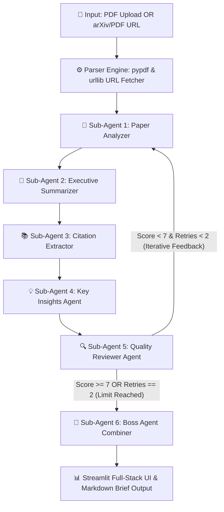

# ⚡ AI-Powered Multi-Agent Research Paper Analyzer
> **AI Agent Developer Intern — Technical Assignment | Vilambo Private Limited**  
> **Submission Deadline**: 24 July 2026, 11:59 PM IST  

[](https://github.com/langchain-ai/langgraph)
[](https://groq.com/)
[](https://streamlit.io/)
[](https://www.python.org/)

---

## 📌 Executive Summary & Problem Statement

Academic research papers are dense, lengthy, and complex. Manually extracting key methodology, findings, and citations is time-consuming and error-prone. 

This project implements an enterprise-grade **Multi-Agent Systems Pipeline using LangGraph & Groq (Llama-3.3-70b-versatile)** to automatically read, analyze, summarize, and peer-review research papers. It features a built-in **Quality Control Reviewer Agent** with automated iteration loops (`retry <= 2`) and supports both **PDF file uploads** and **arXiv / PDF URL fetching**.

---

## 🏗️ Multi-Agent Architecture & Workflow

The architecture uses a state-driven graph built with `LangGraph`, orchestrating **6 specialized agent nodes** with conditional routing and Pydantic-enforced peer review:



### Agent Roles & Technical Responsibilities

1. **Parser Engine (`src/pdf_parser.py`)**: Extracts clean text from local multi-page PDFs or downloads PDFs directly from academic URLs (e.g., `https://arxiv.org/abs/...` auto-resolved to direct PDF streams).
2. **Sub-Agent 1 — Paper Analyzer**: Extracts core methodology, algorithms, datasets, and experimental setups. Dynamically incorporates feedback from previous reviewer retries.
3. **Sub-Agent 2 — Executive Summarizer**: Generates a structured 150–200 word executive summary (problem statement, methodology, novel contributions, and results).
4. **Sub-Agent 3 — Citation Extractor**: Extracts literature benchmarks, prior works, and reference citations.
5. **Sub-Agent 4 — Key Insights Agent**: Identifies real-world practical takeaways, technical implications, and paper limitations.
6. **Sub-Agent 5 — Quality Reviewer (QC)**: Evaluates output completeness on a 1–10 scale using Pydantic structured schema (`ReviewOutput`). If `score < 7`, routes feedback back to Sub-Agent 1 (enforcing `retries <= 2`).
7. **Sub-Agent 6 — Boss Agent (Orchestrator)**: Synthesizes all validated agent outputs into a unified Executive Research Brief.

---

## ⚡ Key Technical Features

- **LangGraph State Orchestration**: State-machine workflow using `ResearchState` (`TypedDict`) for node transitions and memory persistence.
- **Automated Peer Review & Iteration Loop**: Reviewer Agent evaluates depth & accuracy; triggers iterative refinement if score < 7 (Max 2 retries).
- **Dual Input Support**: Accepts uploaded PDF files OR direct arXiv/academic PDF URLs with temporary file auto-cleanup.
- **Ultra-Fast LLM Inference**: Powered by Groq's `llama-3.3-70b-versatile` model for low-latency multi-agent execution.
- **Full Security & Privacy**: No hardcoded API keys. Keys are entered securely in the UI sidebar and processed in local memory.
- **Interactive Full-Stack UI**: Streamlit interface with live sub-agent status tracking, metric cards, tabbed reporting, and 1-click `.md` download.
- **LangSmith Tracing Ready**: Integrated hooks for token usage, latency monitoring, and node-level tracing.

---

## 🛠️ Repository Structure

```text
Vilambo_Assign/
├── app.py                     # Streamlit Full-Stack UI Application
├── src/
│   ├── agents.py              # LLM Factory & Sub-Agents 1-4 definitions
│   ├── graph.py               # Reviewer Agent, Boss Agent, & LangGraph Workflow Logic
│   ├── pdf_parser.py          # PDF Text Extraction & URL Fetcher Engine
│   ├── state.py               # TypedDict ResearchState Schema
│   └── tracing.py            # LangSmith Tracing & Observability Setup
├── sample_paper.pdf           # Sample Academic Paper for Testing
├── sample_paper.pdf_research_brief.md # Sample Generated Output Brief
├── build.md                   # System Architecture & Technical Specifications
├── notes.md                   # Development Log & Design Notes
├── requirements.txt           # Python Dependencies
├── .env                       # Environment Variables Template
└── README.md                  # Comprehensive Documentation
```

---

## 💻 Local Installation & Setup Guide

### 1. Clone Repository & Navigate
```bash
git clone https://github.com/<your-username>/multi_agent_research_paper_summarizer.git
cd multi_agent_research_paper_summarizer
```

### 2. Set Up Virtual Environment & Dependencies
```bash
python3 -m venv venv
source venv/bin/activate  # On Windows: venv\Scripts\activate
pip install -r requirements.txt
```

### 3. Run the Streamlit Application
```bash
streamlit run app.py
```
Open `http://localhost:8501` in your browser:
1. Enter your **Groq API Key** and **LangSmith API Key** in the left sidebar configuration.
2. Upload a PDF or enter an academic PDF URL (arXiv/direct link).
3. Click **🚀 Analyze Papers with Multi-Agent System** to observe real-time agent execution and full LangSmith tracing.

---

## 🗣️ Technical Walkthrough for Interviewers

When explaining this architecture in a technical interview or demo video:

1. **Why LangGraph?**: Unlike linear chains, LangGraph allows cyclic state loops (`Analyzer -> Reviewer -> Retry Loop`).
2. **Why Groq?**: Multi-agent loops require fast inference. Groq's LPU provides ~300+ tokens/sec, preventing latency bottlenecks during iterative retries.
3. **Quality Control**: The Reviewer Agent uses Pydantic structured output (`score`, `feedback`, `approved`). If `score < 7`, feedback is injected into the state for Sub-Agent 1 to fix on retry (strictly bounded by `retry_count <= 2`).
4. **URL Fetching Security**: Academic URLs are streamed into temporary files, parsed, and immediately unlinked/deleted from disk for memory safety.

---

## 🤝 Submission Details

- **Company**: Vilambo Private Limited  
- **Position**: AI Agent Developer Intern  
- **Deadline**: 24 July 2026, 11:59 PM IST  
- **Deliverables**: GitHub Repository + 3-Minute Demo Video + Live Web UI  

---
*Built with ❤️ using LangGraph, Groq & Streamlit.*
